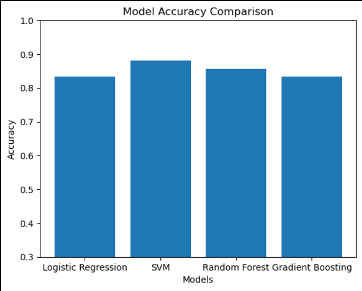

# 🪨 Rock-VS-Mine-Prediction-System

This project focuses on classifying **sonar signals** to distinguish between **Rocks (R)** and **Mines (M)** using machine learning models.  
It demonstrates model comparison, evaluation, and visualization using Python and Scikit-learn.

---

## 📌 Project Overview

- **Problem Type:** Binary Classification  
- **Dataset:** Sonar Rock vs Mine Dataset  
- **Goal:** Identify whether an object is a **Rock** or a **Mine** based on sonar signal patterns  
- **Approach:** Train multiple ML models and compare their performance using accuracy  

---

## 📊 Dataset Description

- The dataset contains **60 numerical features**
- Each feature represents the **energy of a sonar signal reflected at a specific frequency band**
- These 60 values together form a **signal signature**
- Target labels:
  - `R` → Rock
  - `M` → Mine

> The classification depends on the **pattern across all 60 features**, not on any single value.

---

## 🧠 Machine Learning Models Used

The following models were trained and evaluated:

- Logistic Regression (Baseline model)
- Support Vector Machine (SVM)
- Random Forest
- Gradient Boosting

All models were trained on the same dataset for fair comparison.

---

## 📈 Model Accuracy Scores

Logistic Regression  : 0.8333
Support Vector Machine (SVM) : 0.8810
Random Forest        : 0.8571
Gradient Boosting    : 0.8333

---

## 📊 Model Accuracy Comparison

The following visualization compares the accuracy of different machine learning models used in this project:

